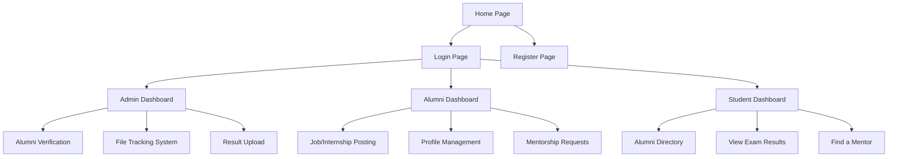

# UI/UX Interaction Flow

This document defines the navigation structure and user journey for the Alumni Portal.

## 1. Authentication Flow
- **Landing Page**: Overview of the portal, login button, and registration links.
- **Registration**: 
  - Choice between "Alumni" or "Student".
  - Redirect to respective profile setup after email verification.
- **Login**: 
  - Dual authentication (Email/Password).
  - Redirect to role-specific dashboard based on user role.

## 2. Admin Experience
- **Dashboard**: 
  - Stats (Total users, pending approvals, file count).
  - Recent activity feed.
- **User Approvals**: Table of pending alumni registrations with "Approve/Reject" actions.
- **File Tracking**: 
  - List of all files and their current status/location.
  - Form to "Create New File" or "Move File" to next department.
- **Result Upload**: Interface to drag-and-drop result files.

## 3. Alumni Experience
- **Dashboard**:
  - Personal stats (Profile views, job post activity).
  - Mentorship requests.
- **Post Job**: Simple form to create a new job or internship listing.
- **Networking**: View other alumni profiles and student mentorship requests.

## 4. Student Experience
- **Dashboard**:
  - News/Announcements.
  - Search bar for alumni directory.
- **Results**: Secure area to input student credentials and view semester performance.
- **Mentorship**: Browse alumni and click "Seek Guidance" to initiate contact.

## 5. Navigation Structure (Sitemap)

