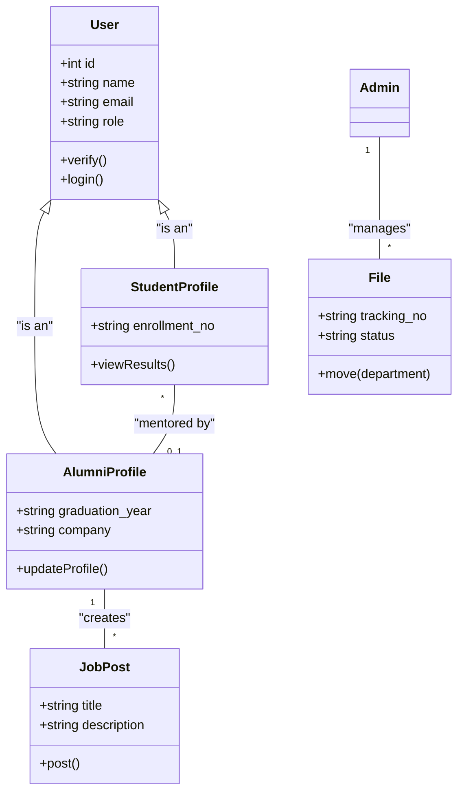

# UML Architecture

This document outlines the system interactions and structural models for the Alumni Portal.

## 1. Use Case Diagram
Describes the interactions between users (Actors) and the system.

```mermaid
useCaseDiagram
    actor Admin
    actor Alumni
    actor Student

    package "Alumni Portal" {
        usecase "Verify Registration" as UC1
        usecase "Upload Results" as UC2
        usecase "Track File" as UC3
        usecase "Post Job" as UC4
        usecase "Update Profile" as UC5
        usecase "Seek Mentorship" as UC6
        usecase "View Results" as UC7
    }

    Admin --> UC1
    Admin --> UC2
    Admin --> UC3
    
    Alumni --> UC4
    Alumni --> UC5
    Alumni --> UC6
    
    Student --> UC5
    Student --> UC6
    Student --> UC7
```

## 2. Class Diagram
Describes the data structure and relationships (High Level).


