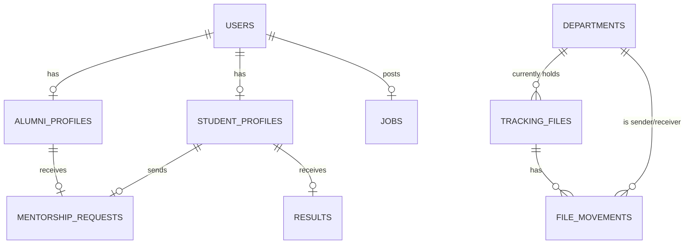

# Database Schema (Preliminary)

This schema defines the core tables for the Alumni Portal, including roles, file tracking, and result management.

## 1. Users & Profiles
- **users**: `id`, `name`, `email`, `password`, `role` (admin, alumni, student), `verified_at`, `status` (active, pending, inactive).
- **alumni_profiles**: `id`, `user_id`, `graduation_year`, `department`, `current_job_title`, `company`, `location`, `linkedin_url`, `bio`.
- **student_profiles**: `id`, `user_id`, `enrollment_no`, `department`, `current_semester`, `phone_no`.

## 2. Alumni Engagement
- **jobs**: `id`, `alumnus_id`, `title`, `description`, `company`, `location`, `apply_url`, `created_at`.
- **mentorship_requests**: `id`, `student_id`, `alumnus_id`, `status` (pending, accepted, rejected), `message`.

## 3. File Tracking System
- **departments**: `id`, `name`, `head_name`.
- **tracking_files**: `id`, `tracking_no` (unique), `title`, `description`, `current_department_id`, `initiator_id` (admin), `status`.
- **file_movements**: `id`, `file_id`, `from_department_id`, `to_department_id`, `action_by` (user_id), `comments`, `created_at`.

## 4. Results Management
- **results**: `id`, `student_id`, `subject`, `marks`, `grade`, `semester`, `academic_year`, `uploaded_at`.

## RELATIONAL MERMAID DIAGRAM

